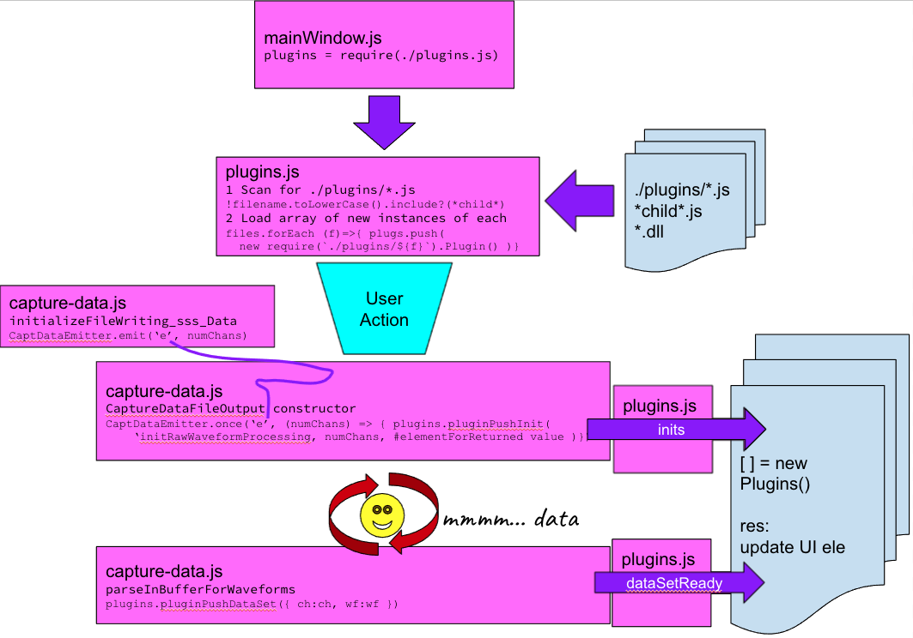

## Overview

Plugin wrappers should contain the template functions necessary to be loaded by DacqMan. See ./plugins/dummyWrapper.js or other examples in the plugins directory.

Wrapper form is updated to match a class implementation, exported as "Plugin".

Note the varied options depending on whether the wrapper is a single or parent-to-child wrapper configuration.

Wrappers with "child" in the name are not loaded.

## Checklist

1. Add / customize file and library name
1. Add Init() function that implements parameter-dependent inits (including forks)
1. Add Ident() function to indicate compatibility with this plugin system (placeholder)
1. Add SetEv() function and customize  subscriptions to events
1. Plugin class exported as Plugin : ClassName

### Where
1. Use asar option to package while keeping the plugins directory plainly exposed within the bundled app.
1. Add your custom plugins (e.g. dlls) and wrappers (e.g. wrapper.js) into the plugins directory, next to each other, same level of heirarcy, not nested.
    - If you plugins require additional files, e.g. in the ./user-data/ then it is suggested to keep those directories also out of the asar package (placed rather into unpacked) and add those. Unless you are using the preferences override to set a custom user-data directory for files, if that feature is available.
3. DacqMan checks the plugins directory for .js wrappers and loads them on startup.

#### Bundled

Where to locate the directory to add plugins to the packaged/bundled app.

##### MacOs
Packaged, Packed: dacqman.app > (Show Package Contents) Contents > Resources > app.asar.unpacked > plugins

##### Win
Packaged, Not Packed: dacqman-win32-x64 > resources > app > plugins

## TODO 

- Unpack the user-data or ensure using __dirname or whatever handles that for customized example from user needed for their implementation - verify with them
- Maybe add a generic stop call for Plugins for STOP button click etc.
- Customizer using eletron-edge-js 12.18.5
- If looks like multiple plugins or options will become useful, update directory structure such that plugin files like wrapper(s) dll(s) live in a plugins/subdir isolating each plugin fileset into its own subdir.

## Flow

**rawWaveformProcessing** plugin (plugin that responds to that init message and to the dataSetReady event)

