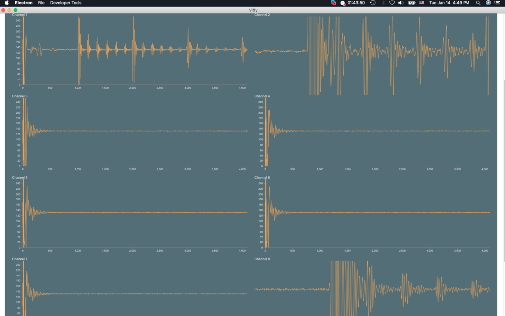
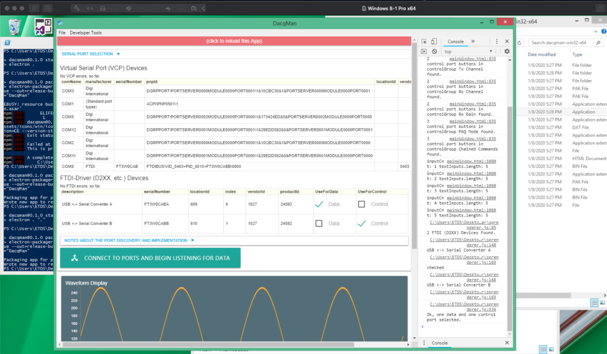
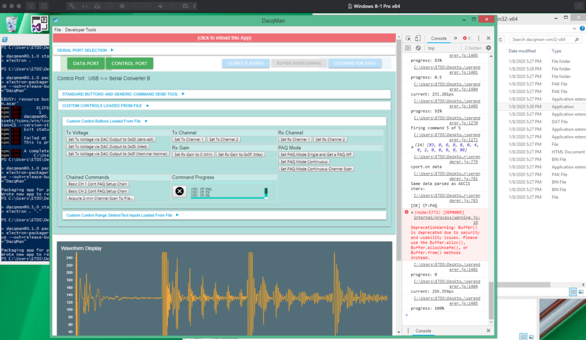

# DacqMan (UT)

## Intro

Electron App (Experimental) for R&D/Experimental Ultrasound Hardware

### Description

Dacqman is demo software sketch(es) aka DevKit for 
- the HDL-0108-RSCPT (RS8) OshaBlue 8-Channel Rapid Scan Ultrasound Embeddable Hardware Prototype
- the HDL-0104-RS104 (RS104) 4-Channel device, similar to the RS8 but with several key application-specific advantages, depending on needs

### Website (additional/related info)

https://oshablue.com/doc/?s=dacqman

https://oshablue.com/doc/?s=hdl-0108-rscpt

https://oshablue.com/doc/?s=hdl-0104-rs104

Other search keys: RS8, RS104


### What is Dacqman for and What is its Status?

Data acquisition and manager, an experimental and demo tool, especially for use with the OshaBlue
HDL-0108-RSCPT 8-channel or HDL-0104-RS104 4-Channel ultrasound (UT) hardware R&D (for NDT) platform.

Please note, this is a DevKit sort of rapid sketch.  Nothing clean about it.  The intent is just to show how to use some
commands with the hardware, and as a hardware Q/A tool.  It is not a finished piece of software.  Much of the commentary
and notes reflect this being in process.

Pre-pre-alpha type of release at this point.  Exploratory.

Developed primarily on Mac, so not all features have been tested
on Win.

Under heavy development, exploratory.  Rapidly committed
updates.

Though perhaps some useful functional blocks in here:

NodeJS, Electron, D3 for live data charting, MaterializeCss (responsive), node-ftdi (variant), node-serialport, (stream) buffer management, DOM manipulation, storing user preferences,
dynamic/customizable loading of controls from JSON into the runtime for UI/UX

It is a rapid development app, fairly slapped together, intended for testing this or
some prototype hardware.  It has grown a bit into an interesting
experimental and demo tool.  

Yes, it still does leave much to desire in terms of
clean coding and coding best practice.  That's an important caveat.  

Much of which comes from excellent information available on the web, and is noted as such within the code.  Much appreciation for the examples and solutions out there.


### Node.js Version(s) ###

Curently, locked to 10.18.0 as the tested max version.
Per https://stackoverflow.com/questions/29349684/how-can-i-specify-the-required-node-js-version-in-package-json
we could lock the node version with something like:
`{ "engines" : { "node" : "=10.18.0" } }`
in package.json.

However, see notes below, some testing was done, up until and including revision 0.0.10
of DacqMan, using node version 12.13.1 - all functional up until working with
for example nodesynth.

Desire to include for example nodesynth etc without customizing that codebase
means falling back to node 10.18.0 until further dev/changes, etc.

Seems to still rebuild/install ok on darwin and win32.


### Revisions

- **0.0.15** - alpha 

- **0.0.13** - alpha
  - Working towards a release candidate but need to release a rickety version now
  - Plugins architecture drafted - functional packaged, unpacked on Win with edge_native test wrappers and dlls
  - Note the package.json npm install script now explicitly only rebuilds ftdi and serialport. Other modules seem not to need rebuild (yet). And rebuilding electron-edge-js is not yet unbroken but works as a native package so far on Win (edge_native) and minimally on Mac (test netcoreapp, dev only)
  - hardwares.json integration for setting up and attempting auto-recognition (rudimentary) and applying settings for data format (needs further work, esp with additional USB-serial devices on the system)
  - Updated UI ordering of controls for easier single-port hardware testing and in capture mode, sliders closer to the top for usability
  - Pref for port pre-open delay (control)
  - Change scripts for packaging to (a) package-packed-[os: win/mac/linux] (which packs everything but plugins via --asar.unpackDir=plugins) and (b) package-unpacked-[os: win/mac] (which doesn't pack)
  - Windows: Now uses 2000000 baud rate on Windows (real rate) for RS104 eg since baud rate aliasing is no longer required for the FTDI driver 2.12.36.4 (7/5/2021)

  - Tests - only plugin in plugin dir is dummy wrapper .js no data handling, no dll - test with no plugins for operation ok and custom set of parent/child wrappers, options file, and 4x dlls added (1 parent, 3 dependents) and check for functional with live RS104 data, packaged = exe + resources (Win) or .app (Macos), packed = --asar.unpackDir=plugins, unpacked = no asar for the app.  After fresh rimraf node_modules and npm install only
    - Windows 10 Pro - VS2017 Build Tools, VS2019, VS2022, VC++ Redist 2015 among others, USB over Ethernet remote
      - dev (npm start): -/+ plugins: PASS/PASS
      - packaged, unpacked: -/+ plugins: PASS/PASS
      - packaged, packed:   -/+ plugins: FAIL/TODO - need to update path locating for require electron-edge-js for plugins dir at least
    - Macos: OS X: Catalina 10.15.7
      - dev (npm start): -/+ plugins: PASS/TODO 
      - packaged, unpacked: -/+ plugins: FAIL/TODO - need to handle the build method and deployment for packaged - and/or ignore/disable plugins (since none for macos anyway yet)
      - packaged, packed:   -/+ plugins: TODO/TODO

- **0.0.12** - alpha
  - Testing/demo integration with a 4-module add-on SPI multiplexer board showing basic commands
  - Added more comments about Windows (10) FTDI VCP baud rate aliasing.

- **0.0.11** - alpha
  - Testing integration of eg speaker, nodesynth, maybe dsp.js
  - May need to use with node 10.18.0
    - Yes nodesynth eg builds now - but need to rebuild everything again
      - Delete node_modules and rerun npm install

- **0.0.10** - alpha
  - Preliminary support for HDL-0108-RSCPT (RS8), HDL-0104-RS104 (RS104), and DL0100A1 (Flagship, Early HW) including ADMM ADMPlex prototype/proof/testing commands
  - Attempted RS104 and master branch merge
  - Re-partitioned code for baby step improved dev cleanliness
  - Mac OS X: Using node 12.13.1

- **0.0.9** - alpha
  - Incremented revision since previous version was packaged for Mac and Win releases
  - Adds structure id information UI and updated UTR output matching it for data-capture focused UI/UX
  -

- **0.0.8** - alpha - Adds customized batch capture output demo format ("UTR file") to match a user-specific data work flow for legacy compatibility with their software and hardware system. Includes as well a related data-capture-focused UI/UX. Configurable via json config files and simply adjusting source code as well.

NOTE: If you have made any previous customizations for the packaged control buttons and etc using this feature in the software, you'll probably need or want
to use the gear icon (very bottom of the page, left side) for extra options to reset your preferences so that the software can find the new files it needs
to work with the added features.  You can always merge any customizations back into a re-copying of the packages files to your local directory.  When releases get
more stable, then of course this type of need would change, such that pref or customization behavior is migrated or integrated or separated appropriately.

- **0.0.6** - alpha - adds a demo, not well crafted but functional, of start of frame (SOF) parsing to sync the SOF portion of a waveform data
packet to the beginning of the plotted data chart - not clean but worthy at least of playing around with a runtime (packaged) "release"

- **0.0.3** - alpha - multi-chart version with fixes tested on hardware for cross
platform and live dev and packaged, tested on Windows and Mac OS X, npm install works
with correct node version still, even with a package.json re-structure.  Updates for
prefs and custom control button sample file copied to local, as well as collapsible
implementation.  See github Releases tab.  Check commit messages.

- **0.0.1** - pre-pre-alpha, first repository exposure at github, the more recent builds (really, packaged components for a runtime analog or executable) have not yet been tested with live hardware due to timing, and will be soon.  The previous builds, still included in the main repo here however did run on the hardware. If that is relevant at all.  See github Releases tab.  Check commit messages.


### Screenshots

See Also:
http://oshablue.com/bsides/ and search for HDL-0108-RSCPT - there will probably be a menu items listing all relevant
articles.

Screenshot, showing a sample of an 8-channel live view:


Screenshot, Windows, listing COM ports:


Screenshot, Windows, showing buttons and controls loaded from file:



### License

Please see LICENSE file.  MIT License.

Except where other compatibly licensed or CC code has been included gratefully, and has been acknowledged throughout this source code.

And further, extensive gratitude for the general open source and
free software community, providing both core tools and solution
samples.


## Running It

### In Development Mode

1. Install the development environment items as noted below.
(Basically: nvm, node 10.18.0, atom ide)
2. Install the FTDI D2xx driver (maybe - see below regarding drivers -
  HIGHLIGHT: don't install the D2xxHelper.kext or D2xxHelper package at all as shown in the FTDI installation video - that component is not needed for our purposes)
2. `git clone` this repo
2. `cd <project-directory>`
3. `npm install`
4. `npm start`

### Just the Runtime (as built ... basically packaged components for executable analog, or a real exe, depending on your platform...)

1. Download one of the release builds from one of the repo links or a related link (see `release-builds` or `release-builds-external-win32`)
2. Install the FTDI D2xx driver (maybe - see below regarding drivers)
3. Double-click the executable.  If the exe doesn't work, try downloading the whole release directory for that build, and run
it from within there.

#### Run-Time Notes and Usage

- When copying the custom control buttons to local file, using the "settings" gear
icon, please add ".json" to the file extension.  It is NOT added or checked for
at the moment.  You'll get an error on load otherwise.


## Dependencies, Versions, and Building Applications

The current release uses some older versions of Electron, SerialPort, Node-Ftdi
and related, due to compatibilities and prioritizing a functional demo/playground
versus capturing the most recent software, or re-writing some libraries (mostly the node-ftdi) to build under newer
package combinations.

See package.json.


### Drivers - Summary

#### Mac OS X

Install the D2XX drivers as indicated by FTDI for Mac OS X.
Do not install D2xxHelper and so far, you don't need to unload
any drivers.  Notes at the end of this Readme regarding this are
for reference.

#### Windows

##### Drivers and General

Some driver information is listed at: https://oshablue.com/doc/windows-10-fresh-atom-ide-apio/
and beyond that some documented OS-specific driver set up and sequencing is needed.

It may be that the FTDI CDM Windows driver files and/or setup package are not
needed as of this writing on Win 10 Home/Pro as Windows Update may grab them.

In testing here, the driver versions matched (Windows Update versus manually
  run the FTDI driver setup package or the select the files available in the
  FTDI driver file package from their website).

On both a real Win 10 Pro and VM (Fusion on Mac OS X) Win 10 Home the command
`npm install -g windows-build-tools` successfully installed and built both
VS 2017 Build Tools (shows in Start Menu, requires Visual Studio Installer to
  fully remove) and the Windows SDK 10 - both are needed to build eg node-ftdi.
  See node-gyp documentation and also windows-build-tools docs.  This is discussed
  in other sections of this readme.  However, the importance of the driver and baud
  rate information, as noted in the next subsection matter a lot.

However, on one Win 10 Home system on a compact (Wintel Pro) fanless solid state system,
the app simply did not run. Well, it loads, tried standard window-build-tools,
tried manually installing a VS 2017 C++ dev and Win 10 SDK as well as using the
windows-build-tools like `npm --vs2015 install -g windows-build-tools` to install
VS2015. In any/all cases, once the app loaded it immediately halted/broke with an
error about not being able to load/find the ftdi.node file that clearly existed
in the location shown in the errors, including debugging stepwise to watch the
search process.  Similar issues working with creating the settings file in C:\Users\Me\AppData\Roaming\dacqman\ -- haven't yet figured this one out. Will see if
perhaps a packaged Win exe works on this system.  Seems like some kind of access
error, though no explicit permission error is shown and installation permissions
and git-bash user levels (eg Run As Admin... or not) were carefully checked
and repeated.  So this is TBD.  Caveat.

##### Baud Rate (Aliasing)

*WARNING #1:* This means that with other devices, like other USB-COM adapters that cause the system to load on enumeration the same FTDI driver as is used here, if you try to use the aliased baud rate (38400) after the change described in this section, it will map to 2Mbps baud rate (as below) - so if you really need a true 38400 rate on some device... *caution* ... and ... you can just modify this back.  There are of course other solutions too.  However, with signed-driver-only enabled on Windows, either way, this process gets a little more interesting as of this writing and experience at the moment.  You might want to put a README.txt file on the Desktop of your Windows computer to remind unsuspecting users that baud rate aliasing is implemented at the moment.

*WARNING #2:* This section also discusses bypassing some security temporarily to make the change. May or may not be necessary. Please be careful and understand the risks of doing this. If you're not sure, don't do it. 

On these Win 10 Pro/Home systems where the `npm start` at least runs, baud rate
aliasing is required to get the 2Mbps rate that the hardware uses by default.

Without it, for example, opening the data VCP at 2000000 works but the data is
corrupted - you'll see spikes and such throughout - or as it turns out if you're using a DacqMan variant that already has the buad rate set to 38400, you'll get nothing apparently.  Verified several times, comparing Mac OS X versus Windows using plain serial terminal (CoolTerm) and all sorts of tests.  Mac OS X does not need this change so far, again, as of this writing.

For the Win 10 test, without using aliasing, could not see any activity on the TXDEN/ZT485E !RE or DE pins/signals on the
USB-COM485-PLUS2 itself.  Just corrupted data.  Verified by using the CCC/RS104
test ramp output.  Shows there fundamentally.

The Fix: Use Baud Rate aliasing as noted in FTDI's documents about this. Search for the App Note on it.

You can use Device Manager and your existing COM/LPT devices listing (Properties => Driver) to see what driver is loaded for this hardware's COM port adapter. If it is an FTDI driver, check the version so you can tell if it is recent or not (you may not need to update it).  If it is not an FTDI driver then you might need to install the FTDI driver package.  Just good to know what you have now.

You can download the FTDI driver package from ftdichip.com => Drivers => VCP => Windows 10.  These are signed drivers: yay and also not yay. Potentially not yay because since we are editing the ftdiport.inf file to alias a baud rate (see below), that means we alter a driver package file and thus the hash used as a part of the driver signing gets broken and thus if Windows is up to date and running in a normal secure mode, it probably will not proceed with the installation.  Though, installation on another Windows test system worked fine without the need for a signed driver - or even with the signing broken.  Security update patches, or even the UEFI (maybe?) secure boot implementation may have effected this more recently.

The fix for Windows blocking the installation of the modified ftdiport.inf file recently (Apr2021) was to temporarily boot Win10 into Troubleshooting mode where driver signing is disabled.  Method:
1. Hold down shift and select restart from the power menu
2. Select Troubleshooting
3. At the advanced settings (or whatever) window type the number 7 (or whateever) to select the option to boot with driver signing checks disabled.  (BTW this seemed to have potentially created other issues at software runtime which is kind of cool in terms of security if true - they went away after a normal reboot)
4. Then go through the process to modify the ftdiport.inf file to setup the needed baud rate aliasing, and then use device manager to first uninstall any installed FTDI device driver for those USB COM ports (for both ports used by the hardware - maybe any others if you have other devices installed) and then Update Driver => Select/Browse manually and select your modified ftdiport.inf file (or the directory that contains it) that is living along side its other driver files (as downloaded or previously installed).
5. Test the software and then reboot normally (normal driver mode) to make sure things still work.

BTW one way to do this, if an FTDI driver is not yet installed or even maybe if one already is, is to Device Manager => COM Ports => for each of these two (or any as necessary) Uninstall Device then use the Downloaded FTDI CDM / WHQL driver package (not the Setup package but the package that contains the individual driver files), unzip and simply modify the ftdiport.inf file as noted below for the baud rate aliasing, and then select that when you Device Manager => COM Ports as needed => Update driver (manually/select files/directory).  The driver files then get copied to the system directory as needed.  Again, caveat about signing as noted above.

FTDI does offer App Note guides if you want to sign the driver package again after changes using your own properly rooted (and accepted by Microsoft) SSL certificate. You need the Windows DDK too most likely.

Details on the ftdiport.inf file change:

The method here, since the driver was already installed:

Run As Admin => git-bash

`cd C:\Windows\System32\DriverStore\FileRepository\ftdiport.inf_amdyaa_yada_yada`

or, if you need to escape the filepath use like:

`cd C:\Windows\\System32\\DriverStore\\FileRepository\\ftdiport.inf_etc`

Then edit the file, like with:

`nano ftdiport.inf`

Locate the key `[FtdiPort.NT.HW.AddKey]`
and locate the long line that contains Hex coded values for each of the standard
baud rates.

Look for the sequence (shown here in 64-bit format):
9C,80,00,00 and then the next sequence of 4 bytes is what we need to edit.

So, we are changing: 4E,C0,00,00 which means => C04E (is the actual 2-byte 16-bit sequence)
where bits 15 and 14 are the sub-integer divisor, here they are 11 (the highest
  two bits of the C0), and bits 13:0 are the divisor, in this case 04E.

We change this to read:
01,00,00,00 which means => 0001
Which sets the sub-integer divisor to zero and the divisor to 1.
This "1" is a special case that actually selects 2Mbps (2000000).

Save the file.

Using Windows Explorer, right-click this inf file and "Install" - should update
the reg keys or whatever. Unless you run into driver signing issues, and then see above.

This will effectively mean that when the user, in a standard Win COM port API
or interface selects the baud rate of 38400 the driver will actual set up the
chip on this channel (this VCP instance) to 2000000 or 2Mbps baud rate.
This, obviously matters a lot in the code.
On Mac, previous attempts to use baud rate aliasing were not successful - however
they are apparently not needed either.  On Windows, at least the tested Win 10
platforms, this is critical.  The spikes/lost samples etc went away after doing
this, and of course updating the code to use 38400 as the baud rate.

It's probably possible to create a simple custom .inf file included in the file
package that can be used to load the drivers - and would contain this custom
aliased baud rate.


### Development Environment Setup Summary - Windows

Initial steps, if not already done: TODO let's clean this up:
- [With a live Internet connection...]
- Install notepad++ (search for it, use the installer)
- Install Atom IDE
- Install nvm-windows (search for it, use the installer)
- Open a git-bash terminal window
- git clone the repository & cd into it (there may be some retained built node-modules - delete ./node-modules so you can build them fresh for Windows)
- nvm use 10.18.0 (see Windows packaging notes below for remaining items and notes about node versions) (if you haven't already done so) (may need an nvm install 10.18.0 first)
- npm install
  - You may need: `npm install -g windows-build-tools` to complete the install (because it builds stuff)
    (for example, right-click the git-bash icon and Run As Administrator) (perhaps consider exiting bash
    after this to restart as non-administrator until needed again)
- npm start


Development has been with nvm (including the nvm-Windows package, just for the
  purpose of building the Windows exe) and npm.

Been using Atom IDE.

nvm use 12.x.x (latest) worked for a bit, but cleanest builds (installs) are with nvm use 10.18.0.


### Mac OS X - Dev and Package Version Notes

This section is, at the first repository commit, now somewhat outdated.  Please just see package.json.  We are currently just using node 10.18.0, and versions are as noted in package.json.

Interdependent (roughly) versions:

(or please see package.json for current - copied here as well since no comments in JSON)

Node 12.13.1
Electron 4.2.12
Electron-packager 13.1.1
Electron-rebuild 1.8.8
Serialport 6.1.0
Ftdi 1.2.3 (customized src, local with project)
Readable-streambuffer (customized src, local with project)

The node and electron versions are what they are (the latest major revisions) on
Mac to allow serialport (no prebuilds found so far) and node-ftdi (with heavy
modifications) to build.  This is due to such things as the bundled node-gyp
versions bundled with npm and related build issues.  For example, the customization
of the node-ftdi package allowed the package to build under these more recent
major revisions (compared with the alternative), but then hit a point where the
required revisions to build under even newer versions of key packages (node, electron)
were so large, that this was left for a later milestone.

It is possible that an out-of-the-box stock node-ftdi variant roughly version 1.2.3
could build with node 10.x.x instead.  This is how the Windows runtime is built and
  packaged.

### Mac OS X - Building a Runtime App Package

This all builds to an App on Mac OS X using:

npm run package-mac (as elaborated into the command line script call in package.json)

See details below and elsewhere.


### Windows - Building a Runtime App Package

Much the same as above, except to build for windows, cross-compilation wasn't functional
at these package versions.  That is, building the Windows target
from the Mac development environment did not work.

Solution: Fire up the Windows (8 in this case, Pro) virtual machine, install nvm-windows,
install remaining items, etc.  Key points and required items:


Here, ended up that using nodejs 10 (latest = 10.18.0) was the required solution, because
rebuilding seemed not to parallel the experience in Mac.  Was it node-gyp bundle version differences?  Quite possibly just user error and inconsistency.


As of this latest commit, actually using Node 10.18.0 on both and Mac OS X and Windows.  
Easiest way to build everything, and so far all functionally the same.


Install for Packaging:
- windows-build-tools are needed here, e.g. `npm install -g windows-build-tools`
- then start installing the dacqman, actually with Node 10 and the current package.json,
you can simply build with:
- `npm install` from within the project directory

If you need to start fresh to try to re-install, just remove the node_modules
directory.  On Windows, due to module nesting in nodejs (and Windows itself),
you may need an extra tool to delete the directory:
- `npm install -g rimraf` [as in "rm -fr <dir>" = "rimraf"]
- You may get a warning when trying to run this nodejs package via:
- `rimraf <args>`
- , from within Windows PowerShell, something about scripts not being enabled.
- `Set-ExecutionPolicy RemoteSigned` allows the script to run and then e.g. to reset
your installation:
- `rimraf .\node-modules` should works


You may want to tweak the build scripts in package.json, for example to build the win32 exe as a 32-bit application instead of the 64-bit option, as currently selected (x64 arch) - in which case use "ia32" for the arch option.


Refs:
- https://stackoverflow.com/questions/4037939/powershell-says-execution-of-scripts-is-disabled-on-this-system
- https://superuser.com/questions/78434/how-to-delete-directories-with-path-names-too-long-for-normal-delete


## Plugins and Libraries

REQUIREMENT(S):
- Note that this will now require on eg MacOS so far at least, the .NET Core (5.0?)


First draft attempt, will try using electron-edge-js to wrap dlls, as this is most recently updated repo for edge in electron.

Concept will be a framework dependent dll wrap, if we get to that level of need. Try first with .Net Core 5.0 (current, though 3.1 is LTS). Run depends on installing the plaftorm-apropriate .NET Core installation on the OS.  Or assuming the framework (Windows ?) is already installed. Not yet sure if 5.0 will work yet.

Will include a dummy loop back plugin that takes the output waveform data hook and also feeds back info to the UI reference item(s).

Windows: Folder contains the exe and dlls needed, right at the parent level. Calling js wrapper probably "compiled" into resources/app.asar
MacOs: dacqman.app/Contents/Resources/app/ contains all the directories

References:
- https://github.com/agracio/electron-edge-js
- https://stackoverflow.com/questions/42779709/use-net-dll-in-electron
- https://dotnet.microsoft.com/download
- Use the tutorial here for creating dll on MacOs using Visual Studio Code
  - https://docs.microsoft.com/en-us/dotnet/core/tutorials/library-with-visual-studio-code?pivots=dotnet-5-0
  - And creating the tests for TDD:
    - https://docs.microsoft.com/en-us/dotnet/core/tutorials/testing-library-with-visual-studio-code?pivots=dotnet-5-0


### Building the DLL (dummy/test) on MacOS

In this case, we download and install the .NET Core SDK to build the dll, not just the runtime (?)
Visual Studio for Mac is NOT installed (yet?)

(
  Add: for Side-by-Side (SBS) .Net Core 2.1.202 latest / and also obsolete / not supported EOL
  global.json to specify the sdk as 2.1.202
)

dotnet new sln
dotnet new classlib -o StringLibrary
dotnet sln add StringLibrary/StringLibrary.csproj

(SBS change the TargetFramework in this file to netcoreapp2.0 from standard to create a core app)

Class1.cs code:
```
using System;

namespace UtilityLibraries
{
    public static class StringLibrary
    {
        public static bool StartsWithUpper(this string str)
        {
            if (string.IsNullOrWhiteSpace(str))
                return false;

            char ch = str[0];
            return char.IsUpper(ch);
        }
    }
}
```

dotnet build

verify the build output is core app (if you opted for SBS above)

Then proceed with the console app to work with the library

dotnet new console -o ShowCase
dotnet sln add ShowCase/ShowCase.csproj

(SBS test in dacqman from the tested build in electron edge js quick start - just copy the dll over to dacqman with name indicating 21202 coreapp 2)

ShowCase/Program.cs
```
using System;
using UtilityLibraries;

class Program
{
    static void Main(string[] args)
    {
        int row = 0;

        do
        {
            if (row == 0 || row >= 25)
                ResetConsole();

            string input = Console.ReadLine();
            if (string.IsNullOrEmpty(input)) break;
            Console.WriteLine($"Input: {input} {"Begins with uppercase? ",30}: " +
                              $"{(input.StartsWithUpper() ? "Yes" : "No")}{Environment.NewLine}");
            row += 3;
        } while (true);
        return;

        // Declare a ResetConsole local method
        void ResetConsole()
        {
            if (row > 0)
            {
                Console.WriteLine("Press any key to continue...");
                Console.ReadKey();
            }
            Console.Clear();
            Console.WriteLine($"{Environment.NewLine}Press <Enter> only to exit; otherwise, enter a string and press <Enter>:{Environment.NewLine}");
            row = 3;
        }
    }
}
```


dotnet add ShowCase/ShowCase.csproj reference StringLibrary/StringLibrary.csproj

dotnet run --project ShowCase/ShowCase.csproj


### Building the tests

dotnet new mstest -o StringLibraryTest
dotnet sln add StringLibraryTest/StringLibraryTest.csproj
dotnet add StringLibraryTest/StringLibraryTest.csproj reference StringLibrary/StringLibrary.csproj

StringLibraryTest/UnitTest1.cs
```
using System;
using Microsoft.VisualStudio.TestTools.UnitTesting;
using UtilityLibraries;

namespace StringLibraryTest
{
    [TestClass]
    public class UnitTest1
    {
        [TestMethod]
        public void TestStartsWithUpper()
        {
            // Tests that we expect to return true.
            string[] words = { "Alphabet", "Zebra", "ABC", "Αθήνα", "Москва" };
            foreach (var word in words)
            {
                bool result = word.StartsWithUpper();
                Assert.IsTrue(result,
                       String.Format("Expected for '{0}': true; Actual: {1}",
                                     word, result));
            }
        }

        [TestMethod]
        public void TestDoesNotStartWithUpper()
        {
            // Tests that we expect to return false.
            string[] words = { "alphabet", "zebra", "abc", "αυτοκινητοβιομηχανία", "государство",
                               "1234", ".", ";", " " };
            foreach (var word in words)
            {
                bool result = word.StartsWithUpper();
                Assert.IsFalse(result,
                       String.Format("Expected for '{0}': false; Actual: {1}",
                                     word, result));
            }
        }

        [TestMethod]
        public void DirectCallWithNullOrEmpty()
        {
            // Tests that we expect to return false.
            string[] words = { string.Empty, null };
            foreach (var word in words)
            {
                bool result = StringLibrary.StartsWithUpper(word);
                Assert.IsFalse(result,
                       String.Format("Expected for '{0}': false; Actual: {1}",
                                     word == null ? "<null>" : word, result));
            }
        }
    }
}
```


Run tests:
dotnet test StringLibraryTest/StringLibraryTest.csproj

change the data to see failures
rerun tests

npm install electron-edge-js (crash and burn - can't find mono - but most docs seem to suggest not necessary)

in any case, for PKG_CONFIG_PATH (even for finding an old mono installation? in /Library/Frameworks - is this left over from previous work?)
install homebrew from srew.sh...
follow feedback about unshallowing ... (from previous installations...)
(still in process at the moment - as predicted)

aha - yes from old mono installations, the installer is finding these - so use:
- https://www.minicreo.com/mac-uninstaller/uninstall-mono-framework-mac.html#how-to-uninstall-Mono-Framework-mac-p1
  and
- https://github.com/agracio/electron-edge-js/issues/102
```
sudo rm -rf /Library/Frameworks/Mono.framework
sudo pkgutil --forget com.xamarin.mono-MDK.pkg
sudo rm /etc/paths.d/mono-commands
```

And now the npm install process is working
To be sure, trying  (on macos) (again, previously .NET 5.0 was installed - we'll see if this works ...):
nvm use 12.13.1 (or 10.18.0 - see above - though not officially supported pair of electron + node for electron-edge-js)
npm install electron-edge-js (without forcing EDGE_USE_CORECLR=1 which didn't seem to be working)
(building now correctly, not trying to find mono-2)
(no errors - output roughly matches issue above for author success)

will try to clone separately the test repo and run it
git clone https://github.com/zenb/electron-edge-js-quick-start.git
cd [dir]
nvm use 12.13.1
npm install (enjoy small snacks)
follow the Build instructions (using the dotnet cmd - worked)
UI loads and runs but:
edge.initializeClrFunc is not a function
ok - so clr is just not getting loading or something 
actually reving all files in the src for this to use GUIDs from the output during creating the .Net5 StringLibrary test and to match framework 5.0 since that is what we're actually using - deleting the build outputs for .net core 2.0
(without accurate GUIDs - MSBuild / dotnet build doesn't work - just says nothing to restore)
ok - still not finding it - ah - directory is manually set in the code main.js etc to look in app.asar.unpacked - but that doesn't apply here -
so, change to just plain old accurate project directory - and now yes it loads

now the show-stopping game-changer lingo-wielder: CLR complains and crashes on static init issue - not allowed - ok - here is the incompatibility we've all been waiting for: looks like the electron-edge-js readme is (well surprise surprise) is reasonably accurate in compatibility with .Net Core 1.0 - 2.0 and etc so it would seem not compat with .Net5 as per documentations and FAQs / forums on this, as the particular call has been disallowed in more recent .NET (Core?).

However, not wishing to commit or uninstall and then re-install a different version of dotnet at this time - so will try:
- Leaving the electron-edge-js built into the app for Windows dev/users using this in their wrapper for their plugins
  - don't know yet if this will work
- Using ffi(-napi) for macos dll access testing
  - don't know if this will work for the dotnet test stringlibrary


OK ok i relent. So right, would need the dylib on mac built - and would need C exposures anyway - so the C# dll probably wouldn't work anyway.

https://dotnet.microsoft.com/download/dotnet/2.0

Trying to install .Net Core 2.nnn side by side right now to use with electron-edge-js
dotnet --version still gives 5.0.402


```
.../dacqman $ dotnet --list-sdks
2.1.202 [/usr/local/share/dotnet/sdk]
3.1.406 [/usr/local/share/dotnet/sdk]
5.0.103 [/usr/local/share/dotnet/sdk]
5.0.402 [/usr/local/share/dotnet/sdk]
```

ok - testing rebuild the test library
srctest/
global.json
```
{
  "sdk": {
    "version": "2.1.202"
  }
}
```
dotnet --version => 2.1.202 (good)

https://stackoverflow.com/questions/42779709/use-net-dll-in-electron
https://docs.microsoft.com/en-us/archive/msdn-magazine/2016/may/the-working-programmer-how-to-be-mean-getting-the-edge-js
https://github.com/tjanczuk/edge/blob/master/samples/Sample105.cs
https://github.com/agracio/edge-js/blob/master/samples/105_add7_dll.js


### RECAP

#### macos
- to use the dotnet (.NET5 downloaded and installed) and electron-edge-js in this case (as of this writing 11/8/21) make sure leftover old mono framework installations are removed (see link method above)
  - TBD: Likely we want a macos install version that omits this framework? if no plugins being used and we don't want to have to install dotnet - though packaged system should not matter
  - TBD: Will this version work for windows includes?
- TBD: Will ffi(-napi) work with our c# test library? trying ffi


---

## Wish List / TODO

### Known Limitations for Re-Dev/Mod (Maybe's)

1. Chart Frame Rate / Speed: Using d3 for the data chart/graphs works well for demo, and is a good demo of d3 in general. When
trying to parse out waveform data frames and then update 8 channels
however, it could be a little faster to try as a next iteration,
canvas with d3 perhaps, or canvas alone.  Still keeping with
script (nodejs / electron) versus compiled code in this particular
project for a number of good reasons.  So yeah, canvas as a next
step/mod for dev and check update frequency.  In single channel
mode however, using d3 is plenty fast.  And by "speed" and "fast"
just meaning how much the UI update buffer has to be decimated to
keep pace easily with graph updates and without buffer overflow.  
There are probably other code mods as well that could clean up
(make more efficient) the UI updates and buffer processing.


1. Add a data frame parser to the UI as a start too.  Currently,
relying on the error-free data streams.


1. Long duration data capture focused mode captures (more than 15 - 20 minutes) have some kind of resource issues or OS intervention issues (when running unattended?).


1. A million other things.


### For First Alpha Release

- Re-instate data rate testing button/function

- Option for local libraries (in case no net connectivity - or note about this at least)
  - Windows symptoms: PLAY_ARROW instead of the play arrow icon
  - Developer Tools shows no Network connectivity

- Local user copy of the customizable features loaded at run-time, like:
  - Done - Control port buttons
  - Buffer params

- Store user settings like:
  - Done - Window size and dimensions
  - Done - Custom control and config filepath
  - Last opened or closed collapsible accordions for select items like charts?

- Done - Known working builds for Mac OS X and Windows


### General Wish List

- Command sequence implementation / customization:
  - Done - Data run (length, data amount, timed, etc)
  - Done - Buffer control for different capture types (single vs streaming)
  - Optional units changes for the graph
  - UI numeric feedback for slider / range init and changes


- Mobile menu responsive hamburger and functionality
  - Done - Fix the fooling around with it
  - Done - Now: Settings - with some placeholder prefs functions


- Add feature button to silence pulsing - or setTimeout on it
  - Done - Control or update pulse styling so it doesn't fire the scroll bars
  - Perhaps turn off when active data happening in the graph
  - Or just soft glow on
  - Or just call it buffer

- Clean up the structure of the code - not quite the pie-in-the-sky that probably would never happen, just a simple review and re-compartmentalize would be helpful - definite low-handing fruit here


- TDD (oo, bad!): Write tests, especially targeting: See below
 - OS-dependent deployments and packaging
  - https://dzone.com/articles/write-automated-tests-for-electron-with-spectron-m
  - Serial port identification and access
  - Customization and file availability
  - File system interaction (for writing data files)


- Channel selection control and implementation for viewing a single-channel's waveform during channel scan mode


- Record data to file for specified number of captures, or time, or until timeout (ie, multiple options for criterion)


- Add functional UI indicators:
  - Done - Buffer cycling status
  - Done - Buffer overflowing status (and remedy reminder)
  - Done - File writing progress or capture run progress


- Done - Multichannel WF viewer and corresponding buffer mgmt


- Config file


- Done - Retain user settings and prefs even if just starting with UI


- Audible parsing of waveform for HMI type of (H)AI detection


- Lots more bells and whistles and demo data UI/UX


### Long Term TODO

- CRC implementation
- B-Scan with customizable A-scan - to - position - in - space UI control (UI/UX bin here)
- A million other things


## TDD

Beginning TDD using examples at:

https://dzone.com/articles/write-automated-tests-for-electron-with-spectron-m
http://www.matthiassommer.it/programming/web/integration-e2e-test-electron-mocha-spectron-chai/

thus:

```
npm install --save-dev spectron
npm install --save-dev chai
npm install --save-dev chai-as-promised
```

and then add the scripts as presented into package.json

(more coming ...)


## Dev Reminders

Reloading the window (either the click to reload or command-r etc.) will reload
any changes to the window code, but not changes to main.js.


To reload updates to main.js (ipcMain), restart/relaunch the App, for example,
using the command line ```npm start``` if necessary.


## Dev Setup Notes and Tracking Bugs (as related to) and Package Updates

package.json:

```bash
// electron-rebuild as an install directive for serialport with electron see:
// https://serialport.io/docs/en/guide-installation
// $ npm install --save-dev electron-rebuild
// $ npm install (to run the added install script item in package.json)
```

Was using serialport ^6.1.0

### Electron

Re:
- Buffer deprecation warning
- crash with unallocated pointer being freed
- building node-ftdi

npm install electron@4.2.12 from original 4.1.4 at the time of starting this
and so far the ftdi (npm install) build works ok.
That doesn't stop the Electron Helper malloc pointer being freed was not allocated issue.
Could it be also related to the Buffer deprecation warning (that we have chased
  down and opted at this point to keep the versioning we have in order to continue development without having to re-write the FTDI nodejs library)
Trying 5.0.12 with
npm install electron@5.0.12 (from 4.2.12 prior)
npm install (crash)
npm install electron-rebuild@1.8.8 (from 1.8.4 prior)
npm install (crash on ftdi at least, not something else)
npm rebuild (crash)
npm install (crash)
rollback only electron to 4.2.12 and
npm rebuild
npm install
(the two in chain, or even just the install which runs electron-rebuild) works again, retaining electron-rebuild 1.8.8

It looks like with electron 4 => 5, node-gyp moves from 5 to 6, and therein lies perhaps the breakage on building the ftdi package


## Launching (during Dev)

Example to launch, during development (not yet packaged):

1) check npm, that it works. (check paths)
$ which npm

If it doesn't, make sure your paths are setup, try e.g.:
$ source ~/.bashrc (that is where brew installed things in my case)

2) Get into the directory of the app:
cd ~/code/myapp

3) Launch
$ npm start
Or see your package.json file for the startup scripts


## Resources:
https://electronjs.org/docs/tutorial/first-app


## FTDI Device Prep for Async 245-Style FIFO

This applies to our test application.

1. Run FT_PROG or equivalent
2. On your desired channel, if a multi-channel device:
    1. Set the mode to 245 FIFO
    2. Set the driver to D2XX
3. Program the device


## Driver Management

Mac OS X (Mojave/10.14.x)


### D2XX and VCP Current Implementation

#### FTDI D2XX Driver Installation

NOT using kext D2xxHelper.kext from FTDI (would be living in /Library/Extensions/) at this time,
and yes using the kextstat | grep FTDI which returns the com.apple.driver.FTDIUSBSerialDriver (or equivalent)
as being loaded and running.

Yes, using the FTDI files from the D2xx setup:
- ftd2xx.h
- WinTypes.h
in
/usr/local/include/

Yes, using the actual driver (current version) library file and the symlink for:
- libftd2xx.dylib (current version)
- symlink to the current version named: libftd2xx.dylib
in
/usr/local/lib/

The node-ftdi (npm install ftdi) package thus wraps the d2xx driver, and requires the headers installed
by the FTDI driver to build, and is used to access as an FtdiDevice the virtual port
instance that enumerates and handles the rapid parallel data stream from the hardware.

#### VCP

Currently, though our hard-coding tests and chopping into the node-ftdi code did
build and allow for d2xx node-ftdi use of the second enumerated port that is configured
as a serial port, it seems cleanest and most easy to configure, to use the VCP,
even the VCP variant of the enumerated control port, configured as a serial port.  
Even via the Apple USB FTDI serial (VCP) driver.  You may need to explicitly load it,
using sudo kextload -b etc etc, if you have unloaded it during d2xx installation or other
testing.

So, this Apple VCP should show up during kextstat | grep FTDI.

And thus, the 2nd enumerated device associated with the hardware, that is, number
zero or letter B (at the time of this writing) should show up both in the VCP section of the
App here as well as in the FTDI Device section.  The code at this writing will use the VCP
interface to talk to the control port.


#### RS104

RS104 uses VCPs in the code implementation for both ports, not the async fifo style as the
HDL-0104-RSCPT ("RS8") uses for its data port.

##### Mac OS X

When the USB-COM485-PLUS2 is connected to Mac OS X (10.14.6),
`sudo kextstat | grep FTDI` shows that `com.apple.driver.AppleUSBFTDI (6.0.0)`
is loaded.  And this handles the comms to/from the hardware just fine so far.
Even at 2Mbps.


##### Windows (10)

Had previously installed libusbK for use with the Lattice Semi programmer cable
or similar emulation for testing device programming from Windows.  
See https://oshablue.com/doc/windows-10-fresh-atom-ide-apio/.  
This grabs the connected USB-COM485-PLUS2 when it shows up.  So if you have this installed,
you need to uninstall it or deactivate it.  Verify with Device Manager.  

You can use the Zadig tool to deactivate the libusbk driver that gets loaded when this
RS485 USB converter device is connected to your machine.  Download and run it.
Select List All Devices to locate the connected USB-COM485-PLUS2 device.  It will
show that libusbk is currently loaded.  And will offer to Replace it with WinUSB
or something else of your choosing.  You would click Replace.  However, this might
not get the FTDI drivers loaded.

In this fresh Win 10 test scenario, did also use the FTDI VCP driver Setup package to install
the FTDI drivers, it apparently installs both VCP and D2XX drivers.

Then in Device Manager, right-click the libusbk device and click uninstall, making
sure to check "delete driver".  Then when you disconnect and reconnect the adapter,
it should load now the FTDI drivers you installed, and you should see two COM ports
in the device manager's device tree.

And if you need libusbk again for Lattice programming, you can use Zadig again
to select and install the driver for that particular cable/device.


### D2XX Details and Dev Notes

Ended up using d2xx with modified node-ftdi on Mac (so far) because baud rate
aliasing didn't seem to be working, though the notes for aliasing are still below.

For d2xx, it was not necessary to remove the FTDI VCP driver(s).  

Up to 3Mbps worked directly in node-serialport with the FTDI VCP driver, no
aliasing needed.

However, aliasing just seemed to be "dead".  That is, regardless of the output
baud selected, and regardless of the input baud selected, or even using BAUDALL,
there seemed to be no actual change in the baud rate from the selected value,
as long as the selected value was in range.

Hence, the move to node-ftdi with d2xx.  Once this could build with our newer
node version (after adjustments to code), and then also:


#### FT_PROG for Mac OS X / Linux

*TODO!* (Test out options and report back ... )

#### Installation and Setup for node-ftdi and d2xx

You can use the FTDI instructions from their website, including the video, up to
a point.  Basically, you download the ftdi d2xx driver package and copy the dynamic
lib file (dylib) into your `/usr/local/lib` and also create a symbolic link
that is version independent.  And you install the d2xx helper program, if appropriate.

Then (the video doesn't show this part because it's more needed for node-ftdi):

Copy the needed header files for the d2xx libraries into your include directory.

These files are: `ftd2xx.h` and `WinTypes.h`

The include dir was: `/usr/local/include`

In practical use here, we had already removed the Apple FTDI USB Serial driver.
Then, the same kextunload command was used to unload the FTDI VCP driver.
Now, when running the App, node-ftdi was able to see the FTDI device and
calls to `open` with a baud rate of 12Mbps for example nicely, again,
measuring the width in time of a binary `1` in 0xAA being written to the device
and read back (because the device is wired into a loopback with Tx being connected
to Rx).

So far so good.

#### Development Notes for node-ftdi

Much appreciation for the node-ftdi package!

See below for mod'ing custom variants of the package and installing.

However, AFAICT it looked like it would not install with our project's node version
(v11).  I.e. `npm install node-ftdi` hit errors upon `node-gyp` build.  Makes sense
as it's possible from the visible commit messages that Node v4/5 was the last target.
And perhaps some legacy applications still depend on this.  And v8 updates and changes
are sufficient to break things.  The solution is in the updated code used here.  Though further
updates are required to deal with some deprecations.

`npm install ../3rd-party[or whatever this directory is called]/node-fdti`

Installs the local-only node-ftdi package with the mods into our project (App)
assuming that we're cd'd into the current project dir already.

Actually, there were several warnings about NODE_MODULE_VERSION issues in the
console on App launch, so:

```bash
$ cd project-dir
$ npm rebuild
$ npm install
$ npm start
```
Did it.  Now, actually, with our local snapshot and updates, using
node 10.18.0, it just builds straight away (though many warnings
  relevant too) with the npm install.

In Summary:

1. Change the code in ../my3rdPartyDir/node-ftdi/src
2. Terminal/command line, already in the main project directory, and then:
3. npm install ../my3rdPartyDir/node-ftdi (triggers errors, but copies files it seems)
4. npm install (due to the inclusions in our project package.json, includes a rebuild)
5. npm start . (works, with the updates in the 3rd party project, here node-ftdi)

Requirements for the above build to work:

`package.json: "ftdi": "file:./third-party-custom/node-ftdi"`
and then `electron-rebuild`


### Useful command examples:

```
(Unplug device)
$ sudo kextunload -b com.apple.driver.AppleUSBFTDI
$ sudo kextunload -b com.FTDI.driver.FTDIUSBSerialDriver
$ sudo kextcache -system-caches (not sure if required, it comes from an ORS ticket, below)
$ kextstat | grep FTDI
$ sudo kextload -b com.FTDI.driver.FTDIUSBSerialDriver
(Replug-in device)
$ kextstat | grep FTDI  (use whenever needed to see what is loaded)
```

### Baud Rate Aliasing in the FTDI VCP Driver

Edit the Plist.info for the driver located at:
/System/Library/Extensions/FTDIUSBSerialDriver.kext (Open Contents => Plist.info)

You can use key BAUDALL instead of e.g. B300 to map all bauds to your aliased
baud BTW.  However, so far, in Mac OS X Mojave 10.14.x, this aliasing is not working.

Heh. However it turns out in this version of everything that you can just open the
port with a baud rate of 3000000 (the maximum it would seem right now) which is nice.

However, we are looking at how to open it with a higher baud ...

Search for the matching PID and VID (convert the hex as typically displayed to
  decimal as used in the plist file) and then add the ConfigData as shown in
  FTID's baud rate aliasing and Mac driver configuration application notes.

App Note: https://www.ftdichip.com/Support/Documents/TechnicalNotes/TN_105%20Adding%20Support%20for%20New%20FTDI%20Devices%20to%20Mac%20Driver.pdf

Web resource (thanks): https://spin.atomicobject.com/2013/06/23/baud-rates-ftdi-driver-mac/

ORSSerialPort discussion: https://github.com/armadsen/ORSSerialPort/issues/18


Mac USB Tools:

$ system_profiler SPUSBDataType

$ ioreg -irc IOUSBHostDevice (or just IOUSBDevice)


## Development Notes and Reminders

Some changes show with the reload (command-R) command.

Some changes, like changing the nodeIntegration setting in the BrowserWindow
spawn do not show until exiting the application and restarting, aka "npm start"


Favorite ref for deleting old release-builds from the git history:

https://stackoverflow.com/questions/10067848/remove-folder-and-its-contents-from-git-githubs-history

`git filter-branch --tree-filter "rm -rf node_modules" --prune-empty HEAD`

`git for-each-ref --format="%(refname)" refs/original/ | xargs -n 1 git update-ref -d`


## Security

Do use recommendations at:
https://github.com/electron/electron/blob/master/docs/tutorial/security.md
https://stackoverflow.com/questions/51969512/define-csp-http-header-in-electron-app


## Data Buffer Configuration

At the time of this experimental revision and writing.


Includes implementation of control-port-buttons.json (custom control port buttons).


1. `control-port-buttons.json`: use a kvp hash element in the `options` array at the root level hash for each control button entry (see example code).  Key/value pairs so far are:
  - singleCaptureBuffer [true|false]
  - captureBufferMultiple [integer]
2. All data received in the on.data event for the data port gets pushed into the stream buffer.
3. But, the allocated buffer size is the captureBufferMultiple value, for the chunking of the stream, if that option is set.
4. The copy to the current charting buffer (either single chart or the multiple waveform chart array) however only copies the first standard buffer size number of bytes (currently 4095 reflecting the hardware's capture control chip implementation).
5. Thus, for example: captureBufferMultiple = 9 and we are scanning all 8 channels on demo hardware.  Here, all data gets pushed into the stream, and all gets written to file if capturing to file.  However, the chunks divided out for graphing/charting are 9x4095 or 9 buffers long.  And only the first 4095 bytes are actually pulled to get plotted.  Thus, we create a rotation, where each first 4095 byte block gets put into a sequential chart buffer, skipping the next 8 buffers.  This has the effect of decimating the data, to have a sane amount and frequency of data going to the charts, to prevent buffer overflow and have reasonable CPU and RAM consumption.  There are other ways.  This is the way it's done here for now.  For an 8-channel graph, the usable options in this low-hanging fruit approach are to skip channels in steps of 8 (so an option value setting of 9, or 17, or just 8xN + 1).  If we're not parsing any SOFs and formally pushing waveforms to the parsed channels from the SOF section of the data, that is.  Just rather, simply, streaming the data, relying on underlying encapsulated data integrity functionality of various components, and decimating/processing at the right ratio to avoid UI loss of data and thus loss of apparent "sync".
6. So: 128 Hz for waveforms arriving goes now to 128/8 => 16Hz per waveform update theoretically. For each waveform chart update, we are at a new channel graph.  So for a single channel, that 16 Hz gets divided up into 8 channels, so each channel's waveform graph gets updated at 2 Hz.  In practice, at this writing, this checks out, with each channel getting updated at 2 Hz for the 8-channel scan.


## On-Going / Interim Dev Notes

For noting what things to search for in tracking dev TODOs, where to hook in to update functionality.  That this section exists here probably says something ... 

### HOOKALERTS

#### HOOKALERT01

For managedStop in DataCaptureFocused mode

TODO - Probably add title property or text subtitle warning that a could delete the latest file fragment if that mode is set in the capture-options.json for how to handle managedStop

#### HOOKALERT02

For hiding more control sections in the data capture focused UI, looking to expose only the minimal necessary items.


#### HOOKALERT03

Storing and restoring values set for text / range inputs loaded from file.

There is both a safety (when functional) and purely functional issue with this feature, though a requested feature.  Please see below, How Stuff Works.


## Modules Notes

### audio-speaker / speaker: looped warning message on terminal

Currently, default package (1.5.1) will dump looped error onto the terminal when running from source, coming from mpg123 and output/coreaudio.c (see the message).
Temporarily, to work around see eg modifying the code and building it from eg:

https://stackoverflow.com/questions/40822969/how-can-i-properly-end-or-destroy-a-speaker-instance-without-getting-illegal-ha

And what I've done in practice is just comment out line 81 in coreaudio.c for a silent fail and then within /node_modules/speaker/ do node-gyp build and it all runs ok without that looped warning.

Of course, this does not persist on a next npm install, until we move it to the 3rd party custom modules directory or similar.


## Resource Usage in Long Capture Durations

Refs:
- https://seenaburns.com/debugging-electron-memory-usage/


## How Stuff Works

### devTools window state storage

Added v0.0.15

If you use the Developer => Toggle DevTools menu items, the devToolsOpen pref (true/false) in settingsStorage changes, all handled in main.js. 

Then when you next start DacqMan that pref is checked, and if true, opens the devTools windows.

However, if you "x" out of devTools to close the window, currently that event is not hooked, to change the stored state of devTools being open or closed. Not low hanging fruit at the moment.

### Stylesheets (UI look and feel)

Added v0.0.15

DacqMan looks on startup for anything other than *custom.css and if it finds it, it uses that.  And otherwise it uses the longest filename ending with *custom.css.

So to add your customized stylesheet that will get prioritized, remove test.css from the /css directory and put in your preferred stylesheet, file named without custom.css on the end.

Also, to simplify your life, just use @import 'custom.css' in your stylesheet and then you don't have to copy everything, only edit the stuff you want to override.  I think.  Right?


### Restore Values for Custom Loaded Text/Range Inputs

There are the inputs, loaded from control-port-buttons.json, that are the text inputs (by default represented as range sliders and can be switched to text inputs).

Feature requested by user customer.

Note that, actually, even if DacqMan loads and restores these saved values, if the hardware has been power cycled, then it will not have saved these settings at all.  By design.  We don't want the hardware to power up go boom right to previous settings, for safety and reliability reasons.  

So for text input representation, at least the values will be populated and the user can just click the button to send them again.  Ok, no problem.

For range slider inputs, restoring the values may either:
1. Trigger an immediate send of the setting (not really desirable necessarily, or just know this and use with caution in your work flow sequencing)
2. Do nothing, even the though the range slider is set to a value.  Because it is the change of the value on the range slider that sends the command right now.

Number 2 there can be handled also in additional code to force behavior, but again, needed functionality needs to be determined against the backdrop of safety and reliability - and also against the backdrop of expected behavior in electronics systems.  

So, there is a pref for each of both text and range settings about whether or not to restore values (pending).